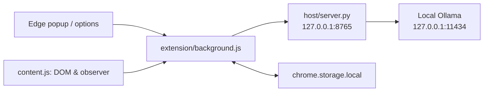

# 优诺本地翻译插件：项目交接

> 交接版本：`v0.7.0`  
> 分支：`main`  
> 公开仓库：[chengjing84/younuo-local-translator](https://github.com/chengjing84/younuo-local-translator)

这份文档面向在另一台 Windows 电脑上继续开发、调试和发布本项目的维护者。项目不依赖当前电脑的私有文件；请从 GitHub 克隆开始，不要复制当前电脑的 `host/config.json`、`.venv`、日志或 `dist` 文件夹。

## 1. 当前能力

- 基于本机 Ollama/Qwen 的 Edge 网页翻译；网页文字只在本机服务与本机 Ollama 之间传递。
- 支持中文、英文、日文、韩文的自动识别/手动选择与互译。
- 默认“译文”模式会原位替换网页文字。
- “对照”模式会保留原文，并在后方显示带 `〔译：…〕` 标记的译文。
- 网页划词后可使用“翻译”或“润色”。
- 支持固定译法和禁止翻译词。
- 点击“开始自动翻译”后，会按**完整域名**记住翻译偏好：同一域名的子页面、新标签页、SPA 路由和滚动/动态加载内容会自动继续翻译。
- 点击“原文”会停止当前域名的自动翻译偏好，并恢复当前页面原文。
- 翻译执行时，弹窗左上角图标右下角的三颗绿点会依次闪烁；完成、空闲或出错时绿点隐藏。

## 2. 在新电脑开始

### 必备软件

- Windows 10 或更高版本
- Git
- Python 3.10 或更高版本
- Microsoft Edge
- [Ollama for Windows](https://ollama.com/download/windows)

### 克隆并准备模型

```powershell
git clone https://github.com/chengjing84/younuo-local-translator.git
cd younuo-local-translator
ollama pull qwen2.5:3b
# 可选：同时安装另一模型，在扩展设置页中切换
ollama pull qwen3:1.7b
```

模型官方页：

- [Qwen2.5 3B](https://ollama.com/library/qwen2.5:3b)
- [Qwen3 1.7B](https://ollama.com/library/qwen3:1.7b)

### 本机安装与 Edge 加载

1. 双击 `install.cmd`，或在 PowerShell 中执行：

   ```powershell
   powershell -NoProfile -ExecutionPolicy Bypass -File .\tools\install.ps1
   ```

2. 安装过程会创建 `host/config.json`，其中包含随机 token；它只能留在本机。
3. 打开 `edge://extensions`，开启“开发人员模式”。
4. 点击“加载解压缩的扩展”，选择仓库中的 `extension` 文件夹。
5. 打开扩展，完成首次运行页面的本机服务检查。

如 PowerShell 阻止脚本执行，可只对当前窗口临时放行：

```powershell
Set-ExecutionPolicy -Scope Process -ExecutionPolicy Bypass
```

## 3. 目录和架构



| 路径 | 作用 |
| --- | --- |
| `extension/manifest.json` | Edge MV3 清单、权限、扩展版本、图标声明。每次发布改这里的 `version`。 |
| `extension/popup.html` / `ui.css` / `popup.js` | 弹窗 UI、阅读模式、按钮状态、三点绿灯显示。 |
| `extension/background.js` | 浏览器与本机服务的请求代理；保存按标签页/域名的翻译会话及状态。 |
| `extension/content.js` / `content.css` | 遍历网页文字、调用翻译、原位替换、MutationObserver、双语对照、划词工具。 |
| `extension/options.*` | 模型、固定译法和禁止翻译词。 |
| `extension/setup.*` | 首次运行：检查 token、本机服务和 Ollama 模型。 |
| `extension/icons/` | 当前使用的优诺图标 PNG，来自用户提供的 favicon 并做过空白边缘裁切。 |
| `host/server.py` | 无第三方 Python 依赖的 HTTP 服务，调用本机 Ollama API。 |
| `host/config.example.json` | 安全示例配置；真实 `config.json` 永远不要提交。 |
| `tools/install.ps1` | 安装后台并注册 Windows 登录自启动。 |
| `tools/build-package.ps1` | 生成不含 token、日志、虚拟环境的 ZIP 包。 |
| `tests/test_host.py` | 后台与 Ollama 请求结构的单元测试。 |

## 4. 关键状态与实现位置

### 域名自动翻译

状态由 `extension/background.js` 保存在 `chrome.storage.local`：

| 键 | 含义 |
| --- | --- |
| `translationSessions` | 当前标签页已启动的会话，键为 tab ID。 |
| `autoTranslateDomains` | 域名到模型/语言设置的映射；新页面和新标签会从这里恢复自动翻译。 |
| `translationStatuses` | 每个标签页的 `idle` / `working` / `complete` / `error` 状态及已处理数量。 |
| `displayMode` | `translation`、`original` 或 `bilingual`。 |

流程：弹窗的 `START_TRANSLATION` 先保存 tab 会话与域名偏好；页面内容脚本载入后请求 `GET_TAB_TRANSLATION_SESSION`，没有 tab 会话时会回退到当前域名的偏好。点击“原文”会清除当前 tab 与当前域名的偏好。

注意：当前“同域名”是精确 hostname 匹配，例如 `www.example.com` 和 `app.example.com` 被视作两个网站。如需按主域名共享，应在 `background.js` 的 `hostname()` 附近实现 eTLD+1 规则。

### 翻译进行中的绿点

`content.js` 在开始、完成和失败时发送 `UPDATE_TRANSLATION_STATUS`。`background.js` 写入状态并广播 `TAB_TRANSLATION_STATUS`。`popup.js` 接收该消息并在 `.popup-shell` 添加或移除 `is-working`；绿点动画写在 `ui.css` 的 `.activity-dots` 与 `@keyframes dot-wave`。

为避免 iframe 覆盖顶层页面状态，`content.js` 的 `reportActivity()` 只允许顶层页面上报状态。

### 双语对照

`content.js` 的 `renderRecord()` 根据 `displayMode` 渲染：

- `original`：恢复原始文字；
- `translation`：用译文原位替换；
- `bilingual`：保留原文字节点，并紧接插入 `span.younuo-bilingual-translation`。

双语标记样式在 `content.css`。它是内联显示，目的是尽量不破坏网站的布局。对需要更清晰的段落级对照，可以继续优化为仅对 `p/li/heading` 等块级节点插入独立译文行。

## 5. 开发、检查与打包

### 后台服务

手动前台运行：

```powershell
powershell -NoProfile -ExecutionPolicy Bypass -File .\host\start.ps1
```

服务健康检查地址：`http://127.0.0.1:8765/health`。

### 测试

```powershell
python -m unittest discover -s tests
node --check extension/background.js
node --check extension/content.js
node --check extension/popup.js
node --check extension/options.js
node --check extension/setup.js
```

### 在 Edge 中调试

1. 访问 `edge://extensions`，点击扩展的“重新加载”。
2. 对扩展的“Service worker”点击检查，查看 `background.js` 日志和错误。
3. 在需要测试的网页按 `F12`，查看 content script 相关错误。
4. 每次修改 `manifest.json`、图标或文件清单后，必须重新加载扩展。

### 打包

双击 `build-package.cmd`，或执行：

```powershell
powershell -NoProfile -ExecutionPolicy Bypass -File .\tools\build-package.ps1
```

当前脚本版本是 `0.7.0`，会生成：

```text
dist/younuo-local-translator-v0.7.0.zip
```

发布新版本时，务必同时更新：

1. `extension/manifest.json` 的版本号；
2. `tools/build-package.ps1` 的 `$Version`；
3. `README.md` / `README_EN.md` 中需要说明的功能变化；
4. `HANDOFF.md` 的交接版本与能力说明（若架构或流程变化）。

## 6. 已知问题与下一步建议

### 已知边界

- Edge 内部页，如 `edge://extensions`，不允许注入内容脚本。
- 图片、Canvas 内的文字和部分封闭 Shadow DOM 无法直接翻译。
- 动态框架频繁重绘 DOM 时，个别文字可能被重复翻译。
- 翻译只处理当前可见区域，滚动到新区域后继续处理；这能避免一次性请求整页造成卡顿。
- 小模型的速度与质量因本机硬件、模型和网页文本结构而变化。

### 建议优先级

1. **实机回归测试**：在普通静态网页、SPA、无限滚动页、同域新标签与 iframe 页面分别验证绿点、持续翻译和“原文”停止逻辑。
2. **双语布局优化**：对段落、标题和列表使用块级双语显示；当前内联方案侧重不破坏网页布局。
3. **域名策略**：按需要决定 `www`、`app` 等子域名是否共享翻译偏好。
4. **翻译队列可见性**：可在弹窗中增加“队列中 / 已完成 / 出错”的计数，而不仅是绿点。
5. **扩展自动化测试**：可引入 Playwright 与临时 Edge profile，覆盖弹窗、存储与内容脚本的关键流程。

## 7. 安全与提交规范

以下文件已经被 `.gitignore` 排除，严禁提交：

- `host/config.json`：本机随机 token；
- `host/host.log` 和其他 `*.log`；
- `host/.venv/`；
- `dist/`；
- Python 缓存目录。

提交前建议执行：

```powershell
git status
git diff --check
git ls-files | Select-String -Pattern "(^|/)(config\.json|host\.log|\.venv|dist|__pycache__)"
```

最后一条命令不应输出真实敏感文件。确认后再执行：

```powershell
git add -A
git commit -m "说明本次改动"
git push
```
