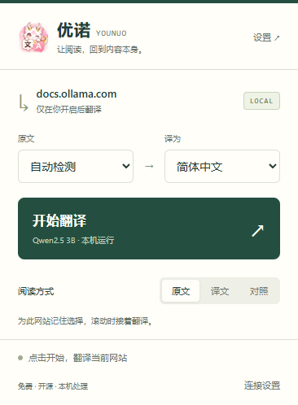

# 优诺 · 本地网页翻译

**让阅读，回到内容本身。**

基于 Edge + Ollama 的免费开源翻译扩展。为已经会安装扩展、运行本地模型的用户而做：连接一次，一键翻译，滚动时继续，随时恢复原文。

[English](README_EN.md) · [B 站：ANNO_YOO杏野](https://space.bilibili.com/13412148) · [源码与反馈](https://github.com/chengjing84/younuo-local-translator)



## 模型选择与教程

| 模型       | 怎么选                               | 本机预热中位耗时 | 安装命令                 |
| ---------- | ------------------------------------ | ---------------- | ------------------------ |
| Qwen2.5 3B | 极致速度，可能漏译或回答原文中的问题 | 约 0.23 秒       | `ollama pull qwen2.5:3b` |
| Qwen3.5 4B | 日常推荐，速度和质量平衡             | 约 0.41 秒       | `ollama pull qwen3.5:4b` |
| Qwen3.5 9B | 质量悠闲，占用和等待更多             | 约 0.66 秒       | `ollama pull qwen3.5:9b` |

4B 另以 12 类样本连续测试 3 轮；这些数字仍不能代表你的电脑或整页速度。

- [三个推荐模型的优缺点、下载体积、硬件建议与 NSFW 说明](docs/MODELS.md)
- [详细教程：环境准备 → 安装连接 → 阅读设置 → 排错与升级](docs/USAGE.md)

也可填写其他已安装的 Ollama 模型，或配置 OpenAI-compatible 外部 API。外部 API 会收到待翻译文字，请自行确认其隐私政策和费用。

## 快速开始

环境：Windows 10 22H2+/11、Microsoft Edge、Python 3.10+；使用本机模型时还需 Ollama。使用插件无需 Node.js；它仅用于开发测试。

尚未安装 Python 时，可先在 PowerShell 运行 `winget install -e --id Python.Python.3.12`；使用本机模型但尚未安装 Ollama 时，运行 `winget install -e --id Ollama.Ollama`。安装完成后重新打开终端或直接重新双击安装器。

1. 安装并启动 Ollama，下载模型：

   ```powershell
   ollama pull qwen3.5:4b
   ```

   极致速度可选 `qwen2.5:3b`，质量悠闲可选 `qwen3.5:9b`。1.7B 不再推荐。

2. **完整解压**发布包，双击 `install.cmd`（不要在 ZIP 预览里运行）。安装器会寻找 Python、创建或自动修复虚拟环境、启动服务，成功后设置当前用户登录自启。后台仅依赖 Python 标准库，无付费 API。
3. 打开 `edge://extensions`，启用开发人员模式，加载本项目的 **extension** 文件夹。
4. 在首次连接页粘贴 `host/config.json` 中的 token，检查连接，选择已安装模型并保存。
5. 回到普通网页，点击优诺 → **开始翻译**。

日常启动：`start-host.cmd`。取消后台自启并停止服务：`uninstall.cmd`；扩展需在 Edge 中手动移除。Ollama 的安装、启动与模型下载由用户自行管理。

遇到问题可双击 `diagnose.cmd`，它会在项目根目录生成不含 token/API Key 的 `diagnostics.txt`，按报告逐项处理或随 GitHub Issue 提交。

如果 PATH 中的 Python 指向错误环境，可显式指定：`powershell -ExecutionPolicy Bypass -File tools/install.ps1 -PythonPath "C:\你的Python路径\python.exe"`。

## 阅读与设置

- **译文**：原位替换文字。
- **对照**：保留原文，紧随显示译文。
- **原文**：停止该网站的持续翻译，恢复其已打开页面的原文。
- **网站记忆**：按完整来源（协议、主机、端口）保存。不同子域名、HTTP/HTTPS 互不继承。第三方 iframe 不继承顶层网站的开启状态。
- **划词**：只翻译实际选中的文字，结果可复制，Esc 关闭。当选中完整的已翻译文本节点时，可对照其原文润色。
- **术语**：固定译法和保护词各最多 100 条，区分大小写。保护标记未被模型保留时返回错误，不默默接受损坏结果。URL 也会被保护。
- **设置导入导出**：只包含模型和术语，不包含令牌。设置页可移除自动翻译的网站。

切换语言会重新翻译当前网站。保存模型或术语后，已开启页面会使用新设置。无法连接时，从弹窗进入连接设置；模型忙或超时时，点击重新翻译/重试。

## 0.9.0 Beta 升级

升级后需重新运行 `install.cmd` 以启动 0.9.0 本机服务，再到 `edge://extensions` 重新加载扩展并刷新网页。旧的模型和术语会保留；外部 API Key 不参与设置导出。

## 0.8.0 升级

1. 运行旧版本的 `uninstall.cmd` 停止旧服务。如果从 0.7.0 升级，它的卸载脚本可能未识别相对路径启动的进程；请关闭原服务窗口，或确认该项目的 Python 服务进程已结束。
2. 更新文件，保留自己的 `host/config.json`。运行新版 `install.cmd` 或 `start-host.cmd`。
3. 在 Edge 扩展管理页点击重新加载，**刷新已经打开的网页**。
4. 旧版的标签页/域名会话被清除，需要在希望自动翻译的网站重新点一次开始。术语和连接设置保留。

## 隐私与权限

翻译正文先发送给 `127.0.0.1` 的优诺服务（默认端口 8765）。默认只交给本机 Ollama；仅当用户在设置中主动选择外部 API 时，才会由本机服务发送到所填 HTTPS 地址。API Key 不导出、不写日志。项目不包含遥测、广告或账户系统。

扩展需要访问网页内容来翻译文字；`tabs` 用于核对网站来源和清理页面状态，`storage` 保存本机偏好，`scripting/activeTab` 用于当前页面注入。后台访问需要令牌，网页来源即使持有令牌也不被接受。不要分享自己的 config.json。

近期译文在浏览器页面和后台内存中有有界缓存，服务退出后后台缓存消失；扩展保存术语、网站偏好与令牌。卸载脚本不删除这些本机配置，删除前可自行导出术语。

## 已知边界

- 模型生成的译文仍可能出现误译，尤其是较小模型、专业术语和长句。结构校验不能证明语义正确，重要信息建议使用对照模式。
- 不翻译浏览器内部页、PDF、Canvas/图片文字、Shadow DOM；第三方 iframe 不自动翻译。
- 编辑器、代码块、translate=no 区域默认跳过。当前按文本节点翻译，跨节点的完整句子可能失去上下文；超过 3000 字符的单节点暂时跳过。
- 页面高频修改、复杂虚拟列表与站点样式仍需更多实际站点验证。只读内容也可能与网站自身框架产生冲突；可以随时停止。
- 前端取消会丢弃旧响应并断开等待；已经交给 Ollama 的推理可能继续到完成或服务超时。模型忙时会提示重试，后台不会无限堆积任务。
- 单次后台模型等待最长约 20 秒，前端请求约 25 秒；非常长的片段或冷启动可能超时。模型质量样本与验证边界见 [验证记录](docs/VALIDATION.md)。

## 开发

```powershell
python -m unittest discover -s tests -v
npm ci
npx playwright install chromium
npm test
npm run check
```

Windows 可使用已有 Edge：运行测试前设置 `$env:EDGE_PATH = 'C:\Program Files (x86)\Microsoft\Edge\Application\msedge.exe'`。测试不需要真实模型；手动质量检查使用 `python tools/model-smoke.py`，需要已安装并启动对应模型。

运行 `build-package.cmd` 生成 dist 下的 ZIP。打包不含令牌、日志、虚拟环境、模型、node_modules；包含许可证、说明和测试。详见 [参与开发](CONTRIBUTING.md)、[版本记录](CHANGELOG.md)。

## 作者与许可证

作者：[ANNO_YOO杏野](https://space.bilibili.com/13412148)。欢迎在 B 站分享体验，在 GitHub 提交可复现的问题。

代码采用 [MIT](LICENSE) 许可证；Ollama 与模型的许可由各自项目提供，尤其 Qwen2.5 3B 使用 Qwen Research License，并非 MIT；详见 [模型许可](docs/MODELS.md#模型许可)。开源不代表对所有网站和模型输出作出准确性保证。

若默认端口冲突，可修改 host/config.json 的 port，并在连接页填写对应的本机地址。后台启动已不再依赖 VBS。
